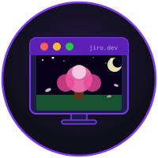

<div align="center">
  

  <h1>jiro.dev</h1>

  <p>Portfolio site built as a fake desktop OS</p>

  [](https://nextjs.org)
  [](https://www.typescriptlang.org)
  [](https://tailwindcss.com)
  [](https://react.dev)

</div>

---

My portfolio site built as a fake desktop OS. Each page is a workspace with its own theme and wallpaper. Windows are draggable, resizable, and minimizable.

**Stack:** Next.js 14, React 18, TypeScript, Tailwind CSS, react-rnd

## Run locally

```bash
cd portfolio-site
npm install
npm run dev
```

Then open http://localhost:3000

## Wallpapers

Drop images into `public/assets/wallpapers/`. One per workspace, named to match the `wallpaper` field in `src/data/workspaces.ts`. If an image is missing the background just falls back to the solid theme colour.

## Adding a project

1. Add an entry to `src/data/projects.ts`
2. Add a `WindowConfig` to the `projects` workspace in `src/data/workspaces.ts`
3. Add an `IconConfig` to the same workspace's `icons` array
4. Add a `case` to `renderContent()` in `src/components/Desktop.tsx`

## Project structure

```
src/
├── app/
│   ├── globals.css          # base styles and window chrome
│   ├── layout.tsx           # fonts and icon CDN
│   └── page.tsx             # root, wraps WindowManager context
├── context/
│   └── WindowManager.tsx    # open/close/minimize/z-index per workspace
├── components/
│   ├── FloatingBar.tsx      # top nav bar
│   ├── Desktop.tsx          # wallpaper, icons, window rendering
│   ├── AppWindow.tsx        # draggable/resizable window shell
│   ├── DesktopIcon.tsx      # click to open a window
│   ├── Dock.tsx             # restores minimized windows
│   └── windows/             # one component per window
├── data/
│   ├── workspaces.ts        # themes, icons, window layout
│   ├── projects.ts          # project content
│   └── skills.ts            # skills list
└── hooks/
    └── useScrollReveal.ts
```

## Workspaces

| Label    | Theme          |
|----------|----------------|
| HOME     | dark / JRPG    |
| PROJECTS | sakura / pink  |
| SKILLS   | purple / anime |
| CONTACT  | forest / green |

To change colours edit `src/data/workspaces.ts`.
